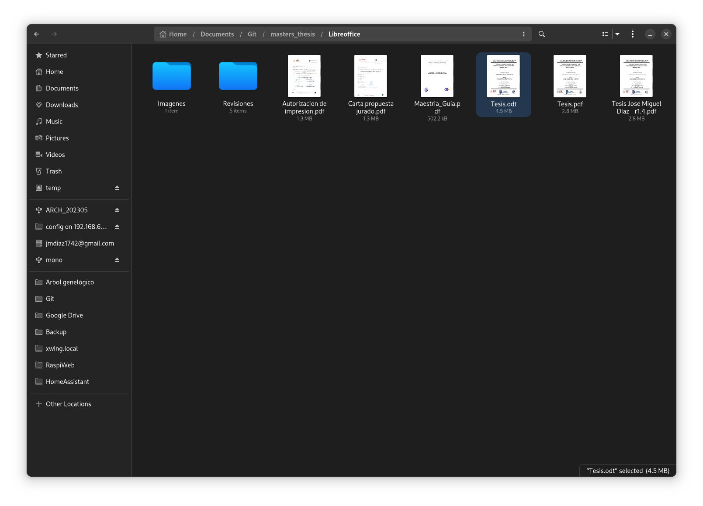
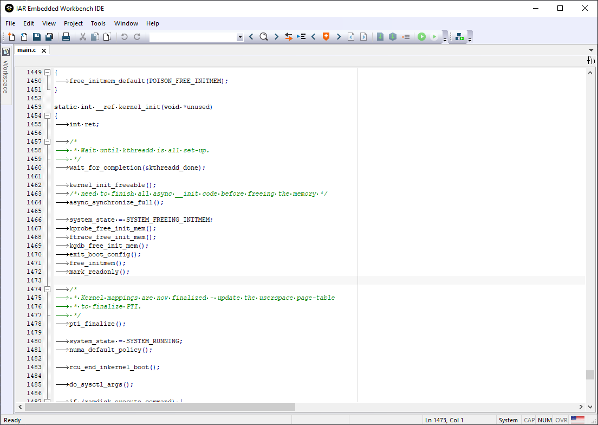
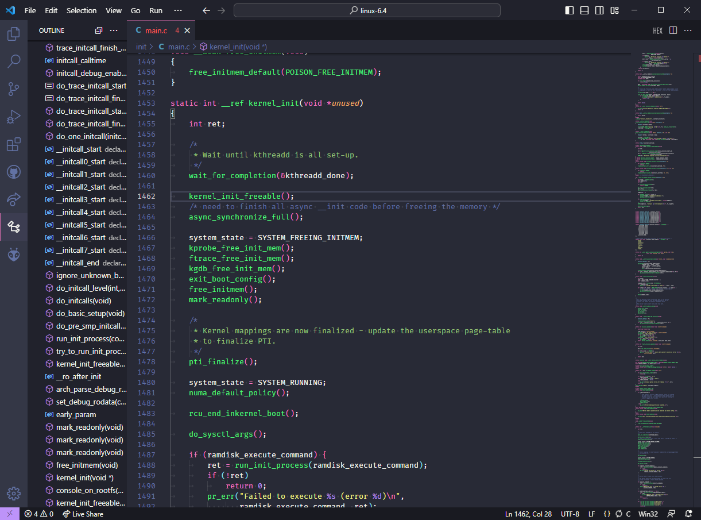
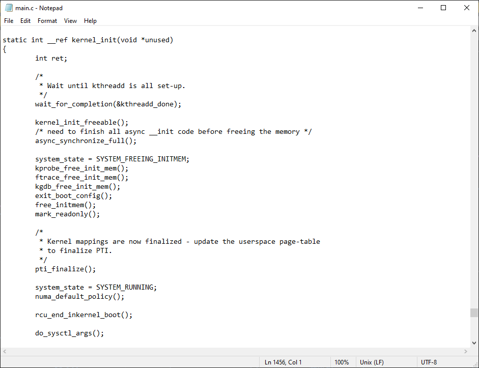

# Introducción a conceptos

## Control de versión

"Control de versión" tradicional

Un solo archivo

Historial de cambios

### Centralizado vs distribuido

### Links
- [Instalar Github Desktop](https://docs.github.com/en/desktop/installing-and-configuring-github-desktop/installing-and-authenticating-to-github-desktop/installing-github-desktop)
- [Git Cheat Sheet Español](https://training.github.com/downloads/es_ES/github-git-cheat-sheet/)
- [Getting Started - About Version Control](https://git-scm.com/book/en/v2/Getting-Started-About-Version-Control)
- [What is version control?](https://about.gitlab.com/topics/version-control/)

## Entorno de desarrollo

### Links

# Editores de texto y Entorno de Desarrollo Integrados
- 4 horas
## Programa
- Editores de texto
	- Capacidades
	- Limitaciones
	- Ejemplos
- Entorno de Desarrollo Integrado
	- Capacidades
	- Limitaciones
	- Ejemplos
- Programa a usar
	- VS Code
	
# Compiladores y depuradores
- 6 horas
## Programa
- Compiladores
	- Compilación vs interpretación
	- 4 pasos de la compilación
- Depuradores
	- Debug vs printf()
	- Usos y limitaciones
- Programa a usar
	- Espressif IDF

# Integración contínua
- 6 horas
## Programa
- Usos
	- Compilación
	- Análisis de código
	- Lanzamiento
- Ejemplos
- Programa a usar
	- GitHub Actions