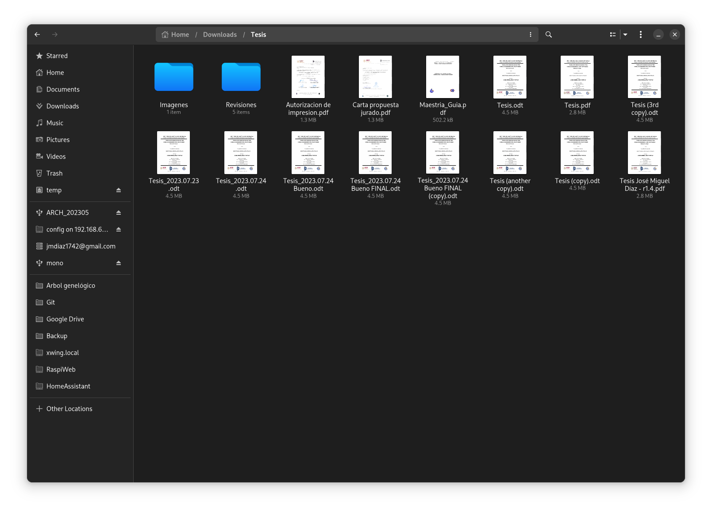
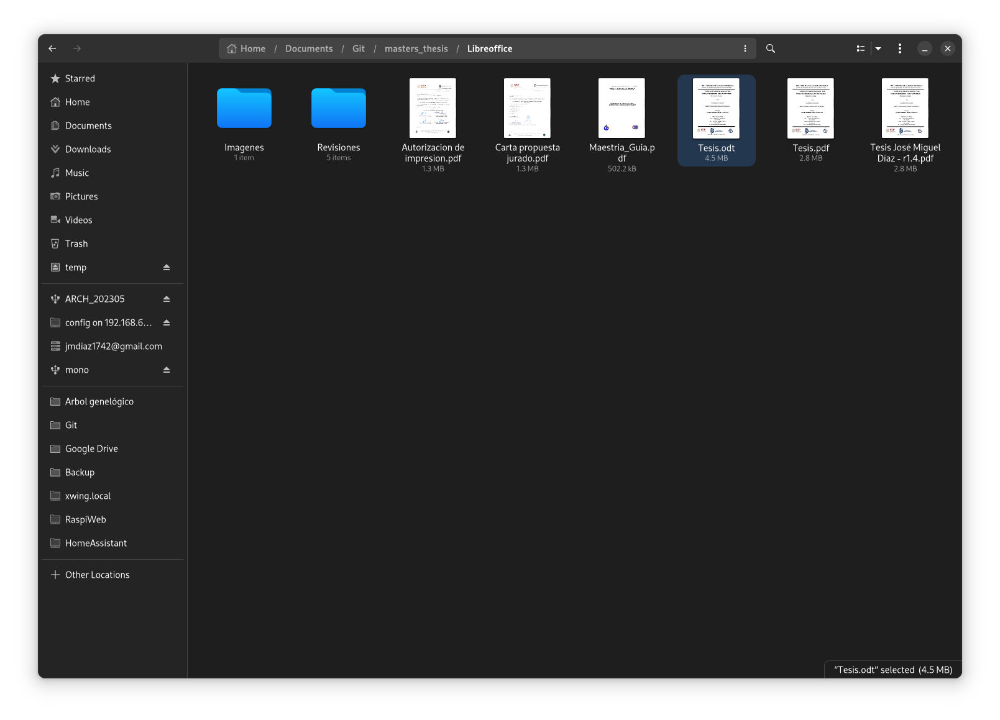
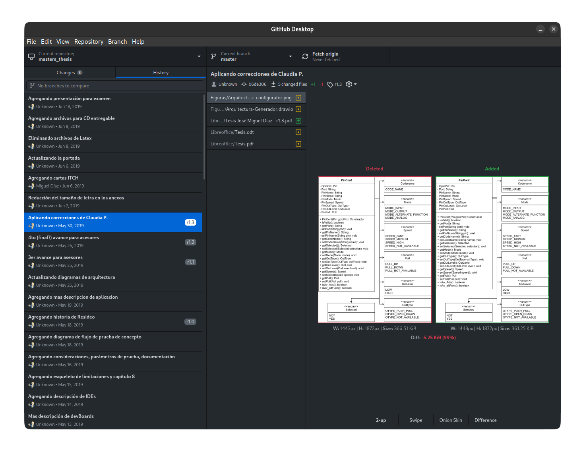
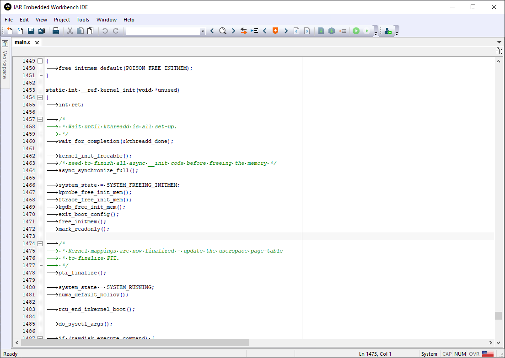
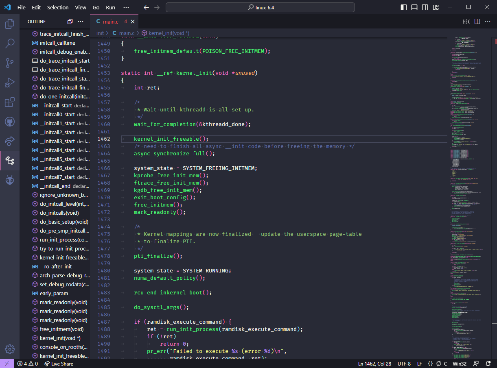
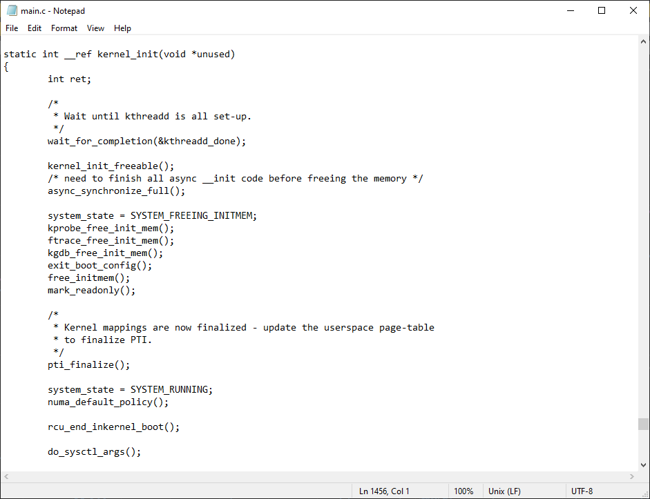

# Control de versión

"Control de versión" tradicional

Un solo archivo

Historial de cambios

## Centralizado vs distribuido

## Links
- [Instalar Github Desktop](https://docs.github.com/en/desktop/installing-and-configuring-github-desktop/installing-and-authenticating-to-github-desktop/installing-github-desktop)
- [Git Cheat Sheet Español](https://training.github.com/downloads/es_ES/github-git-cheat-sheet/)
- [Getting Started - About Version Control](https://git-scm.com/book/en/v2/Getting-Started-About-Version-Control)
- [What is version control?](https://about.gitlab.com/topics/version-control/)

# Entorno de desarrollo

## Links
- [Instalar VS Code](https://code.visualstudio.com/download)
- [What is an IDE?](https://opensource.com/resources/what-ide)

# Compilador

## Links
- [Compilation process in c](https://www.javatpoint.com/compilation-process-in-c)
- [Compiling a C Program: Behind the Scenes](https://www.geeksforgeeks.org/compiling-a-c-program-behind-the-scenes/)

# Depurador

# Integración Continua